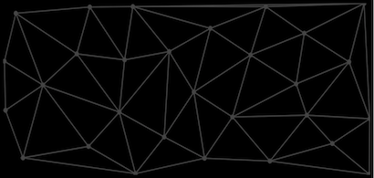

# Delaunay Triangulation
[Demo](https://delaunay.ijpiantanida.now.sh/)   

## Development
1. Install dependencies: `yarn`
2. Start build: `yarn js-watch` and `yarn sass-watch`.   
3. `yarn start` to serve local directory

> `yarn build` to build production version of JS and SASS to `/dist`

## Demo Deploy    
- Deployed using [ZEIT Now](https://zeit.co/home).
